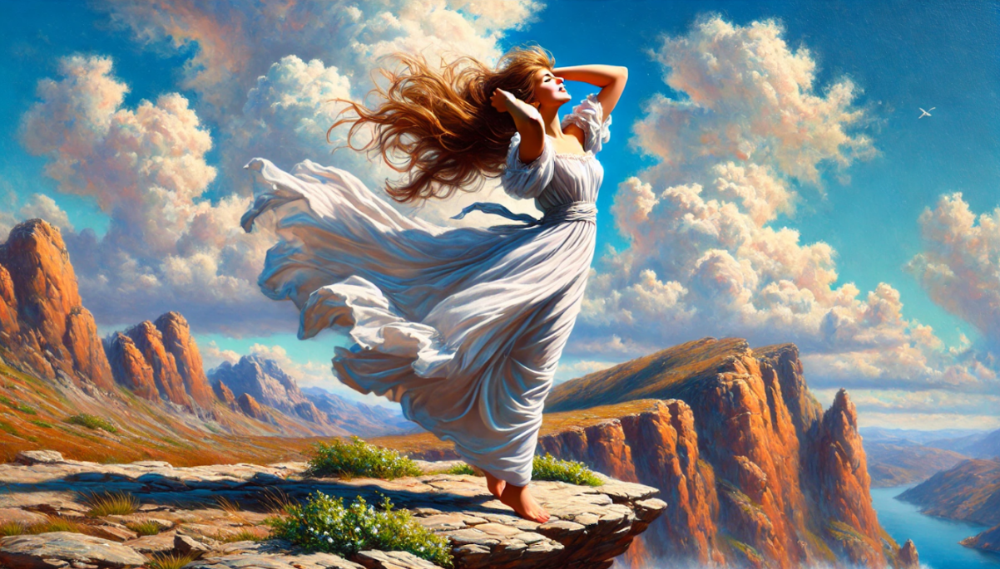
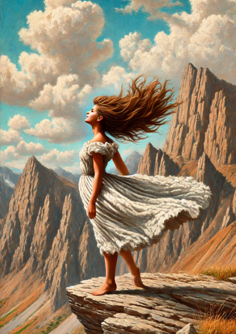
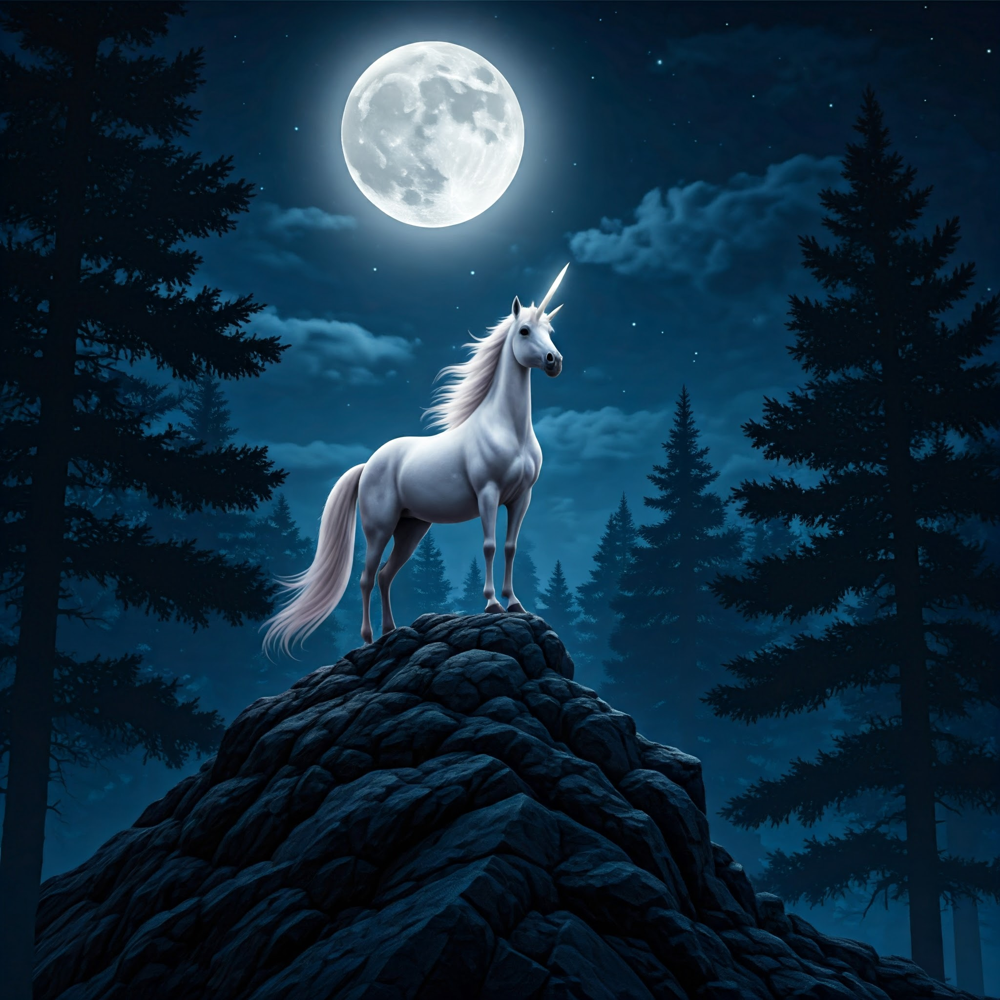
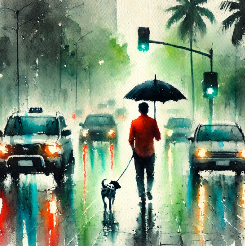
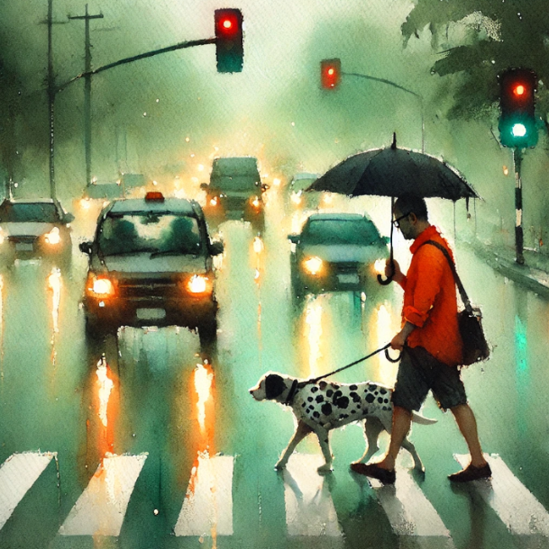
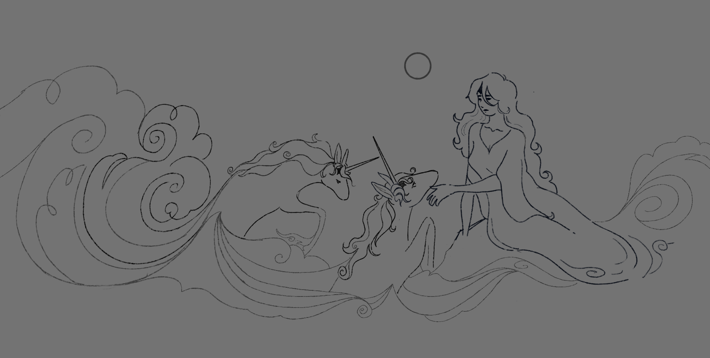
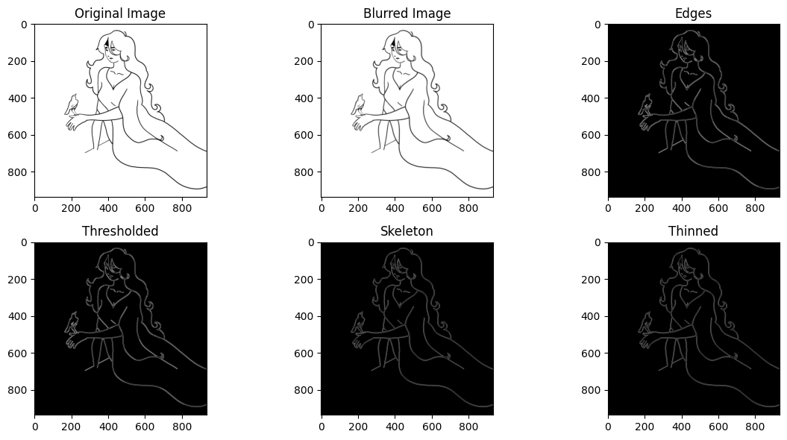
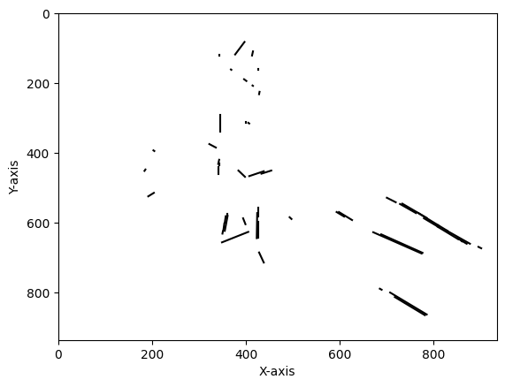
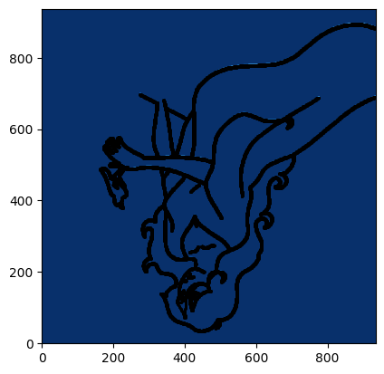
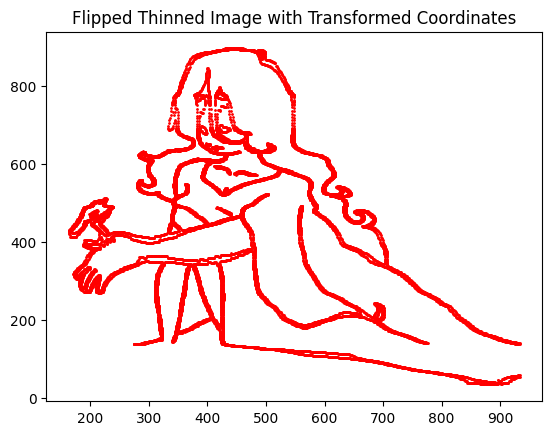

# Final Project: AI versus Art
In this project, I'll be exploring how thinking machines attempt to create art. Me personally, I consider art to be the byproducts of humans attempting to express how they understand the world, or capture the human experience and connect to the experiences of others. I'm not quite sure how to put this eloquently and in a way that doesn't sound like platitudes, but I think for something to be Art, it has to be an expression of your own perspective, emotions, and experiences. By this criteria, whatever AI creates will not and cannot be Art, as it is cannot culminate from emotions and experiences, since, obviously, AI doesn't have any. It will be a knock-off of someone else's product, but it won't be able to capture the emotion or uniqueness of the creators touch. I'm trying to think of a good similie, and the best I come up with is it's like trying to create a rainbow without the "light" of human ingenuity. You can replicate the other conditions perfectly; rain, the air, but still you'll be left with something colorless. I don't think that similie really landed, but! What I'm trying to say is that no matter what prompts I use, the art created will feel soulless.

During this project, I think I might be surprised by how much AI art has grown since I've last messed around with it, or surprised with how close AI can get to creating the Art I'm trying to get it to. However, I'm confident my opinions on weather AI art is art at all will be unchanged. 

<h3>Follow this link to get to the github page with the actual code!</h3>
<h4>https://mkclev3.github.io/machines-that-think/project.html</h4>

<h3>Art Inspiration </h3>

**Ecstasy**

 A 1927 oil painting by Matthew Parrish, titled "Ecstasy"

The feelings this painting creates for me are freedom, wonder, and the excitement of adventure. Specifically, this painting reminds me of the feeling you get when you’ve been sitting for too long, but you finally get up and go outside to run in the grass barefoot, and its windy and you've got so much energy and just such a perfect day. Elation is maybe the word I'm looking for, although Ecstasy is a very fitting one too. 

I really love this painting- it’s got such a Maxfield Parrish look. All of his mountains look the same, which I find funny. I also think her dress is very weird- it's flowy but it looks crusty and it doesn't make much physical sense. It definitely looks like a man painted it, methinks. It reminds me of snowy mountains, or a continuation of the mountains in the background.

The obvious highlight of the painting is the figure itself. You can tell exacly how free she's feeling by the look in her face. Something I've found myself really admiring about this painting is this sense of peaceful and unmarred femininity. I feel like a lot of similar art pieces, even those made by humans, fail to capture a sense of feminine grace and innocence that doesn't feel sexualized. AI, I believe, will be wholly unable to capture her happiness (without feeling hollow or over-the-top) and her particular brand of beauty (innocence? I can't find a word that I think is fitting). These things are the most impressive parts of the painting, and without them I doubt it'll feel beautiful or unique at all. 

Another prediction I have is that AI won't be able to find a way to create a woman that isn't the face of conventional beauty. Not to say the subject of the painting isn't beautiful, but I think whoever AI creates will be a copy-paste of modern beauty standards, no matter what I tell it to do. That's something I've noticed about AI art historically, and it leaves me wondering if it'll have the same problem when creating men. 

**The Last Unicorn**

 A Scene from 1982 film "The Last Unicorn" 

"The Last Unicorn" is one of the animated movies we had on repeat when I was a kid, and it remains one of my favorites. Its got lots of problems though, so please don't quote me on that, but I’m still a fan of the art. 

Looking at this scene makes me feel sad. I’m reminded of a feeling of melancholy, peace, and maybe a little bit of despair.

In this scene, the unicorn has been wandering alone for a long time, attempting to find another creature like her and unaware that she's the only one left. Even if you don't know the context -and despite the fact that the face of the unicorn is unable to create normal expressions- the lighting, the environment, and her body language are enough to invoke these emotions. 

I think its absolutely gorgeous, especially the color and lighting choices. Similar to “ecstasy,” something I really love about this piece is how graceful and ethereal the unicorn seems. I feel like I could stare at this frame for forever; its strangely hypnotizing. I also love the stylistic choice to make a monochrome and semi-abstracted (simplified?) background. It's very unique, and the contrast between the simple shapes and dark color of the background and the bright white and more detailed form of the unicorn is especially beautiful. It pops!

I think the unique art style and emotion without facial expression will be what AI struggles with the most when trying to create a similar piece, and the lack of these two elements will make it uninteresting and emotionless.

**Nadeesh Prabou Watercolor**

 A watercolor painting of a rainy day by Nadeesh Prabou 

I love the atmosphere of this painting. It’s so dark, moody, and gorgeous; I can almost smell the rain. I love the pop of the neon lights, the movement of the windswept trees, and the contrast the the raincoat creates. This painting, even though it’s a little chaotic, still feels peaceful. All of the colors are slightly muted by the rainy weather, which contributes to the feeling of peace. The muted colors, the contrast directing your eyes to the figure, and the relative simplicity of the painting all, to me, create a sense of melencholy and longing. It also feels a bit like a dreamscape because of the hazy edges and the simple lighting and color scheme.

Watercolor behaves very differently to other paint mediums, and it's used flawlessly here. I'm curios to see if AI has been trained much with it, or if it ends up looking like its an actual watercolor at all.

**We Live, We Die**

A digital painting by tumblr user @bc-jpeg, part of a collection of paintings titled "we live, we die" 

This last painting is fanart by an artist I’ve been following for a while, @bc-jpeg. This particular piece is fanart of a creator I don’t really follow, but its so cool! It does have a bit of a tumblr-esc style, but good art is good art, so I'll tolerate no complaints or slander.

A quick ode (not rlly tho) to fanart: fanart has the superpower of being connected to stories that the audience already knows and loves, and I feel that, often, it gives artists the sense that they can skip the "context" while painting, and explore more dramatic or unique subjects. Fanart, even the top percent of it thats really really good, is so fantastical and emotional and dramatic, and I love that, and I love the freedom that gives for creators and the support for artists that it generates.

I love the lighting in this one so much, and I think it’s very well made. Its dynamic, its got beautiful lighting, and a good understanding of form. When I first saw it, I spent 10 minutes just trying to figure out their process and what I liked so much about it. I love the sort of anxiety-inducing (??) quality of this piece. Looking at it I’m reminded of the feeling of pent up emotions, or the feeling of almost being this close 🤏 to losing it. I think the subject looks angry but resigned, which is maybe a combination ai won’t be as accustomed to. He looks very cold, and it feels powerful, in a way. Like that feeling when you absolutely obliterate something and are like yea, im unstoppable, its no biggie. 

I’m interested to see how AI attempts to replicate such a subtle but powerful emotion (/vibe?), and if I'll be able to get it to make anything that has that semi-realism tumblr-would-love-this style.

<h2> An AI Attempt </h2>

Now, AI will put forth it's valiant effort at creating art that doesn't suck.

<h3>Ecstasy: AI Edition</h3>

**Prompt:** Create an image of a girl with long brown hair blowing in the wind and a white billowing dress that wraps around her body standing on the edge of a cliff. The girl is in profile view, and she is standing on her toes. She's standing beneath a blue sky with puffy white clouds, and in the background, there are mountains that are orange and brown, and look scraggly and rough. Its in the style of neo-classical oil painting, and the colors are very saturated. The girl is smiling at the sky and has her hands in her hair. She looks like she feels free

**Prompt:** Make it in profile,not landscape. The girl is standing even more sideways, and looks younger. The dress is a similar texture to the mountains, and looks a lot less smooth. 

[insert analysis here]

<h3>The Last Unicorn: AI Edition**</h3>

**Prompt:** Create an image of a white unicorn that's elegant and ethereal, that's standing on a mountain at night, with trees that are abstract in the background, and a full moon overhead. It's nighttime, and everything is dark blue except for the unicorn, who is illuminated by the light of the moon. 

**Prompt:** Do it again, but make the mood more melancholy, and make the painting more dark blue, and the lines should be less harsh. It should be drawn in the style of 80s 2d animation 

[insert analysis here]

<h3>Rainy Watercolor: AI Edition</h3>

**Prompt:** Create an image of a watercolor painting of a rainy day. The focus of the image is a man with a black umbrella, an orange shirt, and a spotted dog walking in front of him, crossing the road. The entire painting is green tinged, and cars are driving past the road, with their headlights causing red and yellow reflections on the damp pavement. In the background, you can see palm trees being blown in strong wind, and the outline of a building. The painting feels melancholy, and kind of hazy.

**Prompt:** Make it much more undetailed and zoomed out. Make it more watercolor-y and make the entire thing far more green!

**Prompt:** Make the trees blowing in the wind, the building smaller, and the man should be crossing the street in profile view, not walking down the middle.

[insert analysis here]

<h3>We Live, We Die: AI Edition</h3>

**Prompt:** Generate an image of an elegant man with a mustache who is wearing a suit, in the dark. He facing to the side, and is reaching through 3 separate glowing skeletons, who are all going through states of agony. The skeletons are red, pink, and purple. The image is digitally painted, with black sketch lines still visible, and colorful light creating stark contrast. He appears angry but subdued.

[insert analysis here]

<h2> My (painful) Attempt</h2>

Lets go through it! Some of the images are a little shy, and I've accepted that. 

**Reflection:** 

This was... so painful.

I first created a sketch of what I wanted: the woman from "The Last Unicorn" reaching gently towards the other unicorns peering at her from the waves. I didn't make it too complicated, and I didn't end up giving it values; it was just a sketch.

My goal was to create a sketch that invokes similar emotions (to me) as the four original pieces of art I used as inspiration. Some common themes between these pieces were melancholy, femininity, peace, darkness, simplicity, and subtlety. I used the characters from the last unicorn because I can and because I find them all to be graceful and feminine. I tried to imagine a scene that didn't happen in the movie but that I pictured being peaceful. This is why I chose to have her sitting by the water. I imagine her listening to the waves, feeling the wind in her hair, and getting a taste of the freedom the woman in "Ecstasy" feels or the peace from the scene by Nadeesh Prabou. It's melancholic because I imagine she's reaching for unicorns she imagined she used to know but hasn't been able to find in hundreds of years and longing to rejoin them. Her sadness is subtle, though. Her eyes are downcast, and she has a slight smile, as though of assignment.

I liked the scene a lot, but I found the waves to be too large and rough-looking, not as gentle as I wanted them to be. This didn't end up mattering, though, because I replaced 3/4ths of the sketch with a bird in an effort to make the scene simpler. I still imagine it to be sad because instead of looking at her family that she wishes to rejoin, she's looking at a bird that she longs to be free (of this world and of this fate) like.

I did some research (I asked Professor Calvin) on strategies for turning my sketch into something technically created with Python.

First, I loaded my image into Colab, then used a fancy library tool to detect where the lines in the image were. Then, I blurred the lines (so that they're clearer, ironically). Then, I cleaned up the edges, adjusted the threshold, created a skeleton of my sketch, and thinned the skeleton. Did all of these things happen successfully? No. Am I done fixing it and satisfied with how it came out? Yes.

I ended up having one major problem once I figured out how to get the skeleton working properly. And that was that it KEPT PRINTING THE FINAL IMAGE UPSIDE DOWN.

By asking it to print all of the steps, I was able to figure out that the problem was only happening when it was filling the skeleton. I tried for so long to figure out what exactly was causing it to flip, but once Gemini and I were both out of ideas, I decided to focus instead on flipping it back.

This also presented a bunch of problems because everything the internet and Gemini suggested simply *wouldn't flip it*. It was pain, it was misery. I was ready to give up and call it a metaphor.

But then!! Ben helped me, and after a few attempts, it was magically fixed, with a code line I was pretty sure I had tried before. Clearly I do not have the magic touch, but yay! Its done! And the lines are thick and I did cut out most of the original image when I realized how annoying it was going to be to create (although now I realize it probably would've been just as complicated if I used the whole image), but I still like it :)

I have regrets! I do feel like I learned a lot about how PIL and a bunch of other libraries work, and I'm now a lot more comfortable working with python and gemini in general. But looking back, I shouldn't have done the project this way. 

If I were to do this project again, I'd do it the way we practiced with the emoji activity. I thought it'd be more complicated and time-consuming, but the way this went, I would've spent more time actually coding and creating and less time getting stuck behind error after error if I'd done it the emoji method. 

I also don't really feel like I created art using python, my code was mostly just replicating a prior sketch. I would say the sketch was the art, and the python was just the same art in a different medium. If I'd added values to my sketch, I might've felt like I was doing more creating with the python itself, but I'm glad I didn't. Just the sketch was hard enough to figure out, values would've been biting off way more than I could chew. If I were to do a second project, maybe I'd try values, now that I know how to make outlines easily.

It felt like a very overwhelming project at first, especially since I didn't really know how to code, and I kept having failure after failure. However, I really do feel like I grew a lot during it, and I'm slowly understanding that every coding project I ever undertake will probably not make sense for the first decent portion of it, and thats ok! I always figure it out eventually, and what felt like a massive task generally isn't. 

I am really happy we didn't have to make 4 pieces, though. And at the end of the project, I did reluctantly find myself enjoying the problem solving. This was a good project, python is less scary now.

<h2>Citations</h2>
Gemini, my queen 🙏, helped me out so much with this project. 

**Reference:** Google. (2023). Gemini Pro [Large language model]. In Google Colaboratory. Retrieved from [https://colab.research.google.com/drive/1d0USHZM5CdTieP3TD4wOOXmtm3fanoN8?authuser=1]

